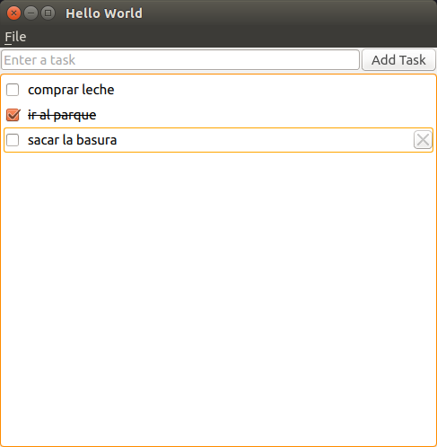

## Ejercicio 2 ##

  

## Entrega ##

- La finalidad es que os "manchéis las manos" con:
	- QML y QtQuick
	- La documentación de Qt

- **1 Semana**

>- El próximo Lunes **antes** de la clase. Revisamos todos en clase
    - juan.morales@live.u-tad.com

>- Cuanta más funcionalidad más nota

>- **20% de la nota final de la asignatura**

## Pasos sugeridos ##

>1. Diseñar la interfaz como en la imágen
    - Utilizar los QtQuick Controls y Layouts
	- ApplicationWindow
	- ColumnLayout y RowLayout
	- TextField
	- Button
	- ListView

>2. Conectar la señar triggered de la acción del menú Quit:
    - El javascript es: Qt.quit()
	- Opcional: Añadir un shortcut "Ctrl+Q"

## Pasos sugeridos ##

>3. Añadir el texto de la línea de entrada a la lista de tareas: 
    - Reaccionando a la señal onClicked del botón
	- Reaccionando a onAccepted del TextField

>4. Borrar tareas de la lista:
    - Reaccionar a Keys.onDeletedPressed (focus: true necesario)

>5. Crear un delegado para el ListView en otro fichero qml
    - Llamarlo Task.qml
	- En el ListView se utilizaría con: "delegate: Task{}"
    - El Task contiene los Checkbox, TextInput y un Botón
	
## ¿Qué mejorarías? ##

> - Añadir alguna transición cuando:
	- se añaden items
	- se eliminan items
	- se tachan items
	
. . .

* Recuperarnos de los errores
    - Undo/Redo al eliminar una tarea
	- Todas las tareas son editables

-----------------------

> - Barra general de progreso de las tareas anotadas Vs completadas

> - Darle aspecto de libreta, con imágenes de fondo y sin los widgets
>   de QtQuick Controls
