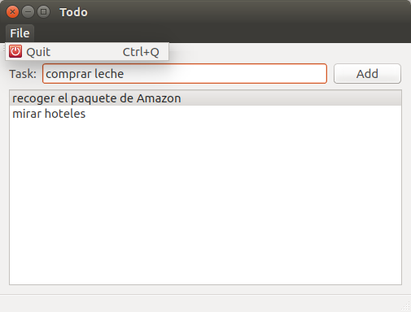

## Ejercicio 1 ##

  

## Entrega ##

- La finalidad es que os "manchéis las manos" con:
	- Qt Designer y el sistema de QWidgets
	- La documentación de Qt

- **1 Semana**

>- El próximo martes después de la clase reviso e-mail
    - juan.morales@live.u-tad.com

>- Cuanta más funcionalidad más nota

>- **20% de la nota final de la asignatura**

## Pasos sugeridos ##

>1. Diseñar la interfaz como en la imágen

>2. Conectar la señar triggered de la acción del menú Quit:
    - Crear el slot al que vas a conectar la señal
    - Poner un qDebug("foo") para comprobar que está conectado
    - conectar la señal deseada al slot recién creado

## Pasos sugeridos ##

>3. Conectar un slot llamado onItemAdded al click en el botón
    - Este slot añadirá el texto de la línea de entrada a la lista de tareas

>4. Borrar tareas de la lista:
    - Reimplementar *keyPressEvent* en Todo para capturar los Delete y BackSpace
    - Eliminar la tarea seleccionada

## ¿Qué mejorarías? ##

. . .

1. Recuperarnos de los errores
    - Undo/Redo al eliminar una tarea
	- Todas las tareas son editables

. . .

2. Visibilidad en las opciones que podemos hacer sobre una tarea
	- Botones para eliminar/completar/editar cada tarea

-----------------------
. . .

3. Acelerar la interacción para los expertos
	- Conectar el *returnPressed* del *inputText* al mismo método que el botón
	- Atajo para el quit "Control-q"
	- Ordenar los TAB para pasar rápido del *inputText* a la lista

>- **Dependiendo de requisitos:**
    - Acercarnos más al modelo mental de una lista de tareas:
	    - Las completadas se tachan y se ven tachadas
    - Barra general de progreso de las tareas anotadas Vs completadas
