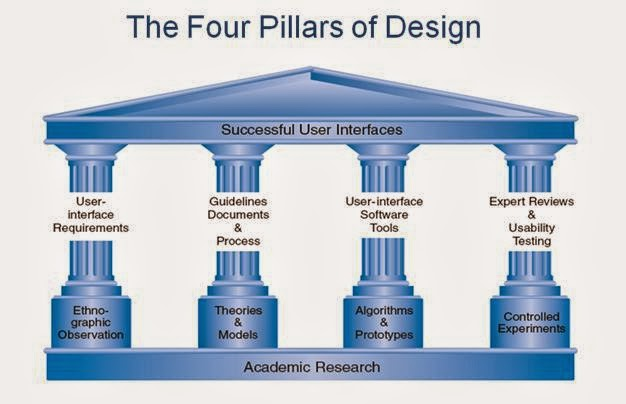
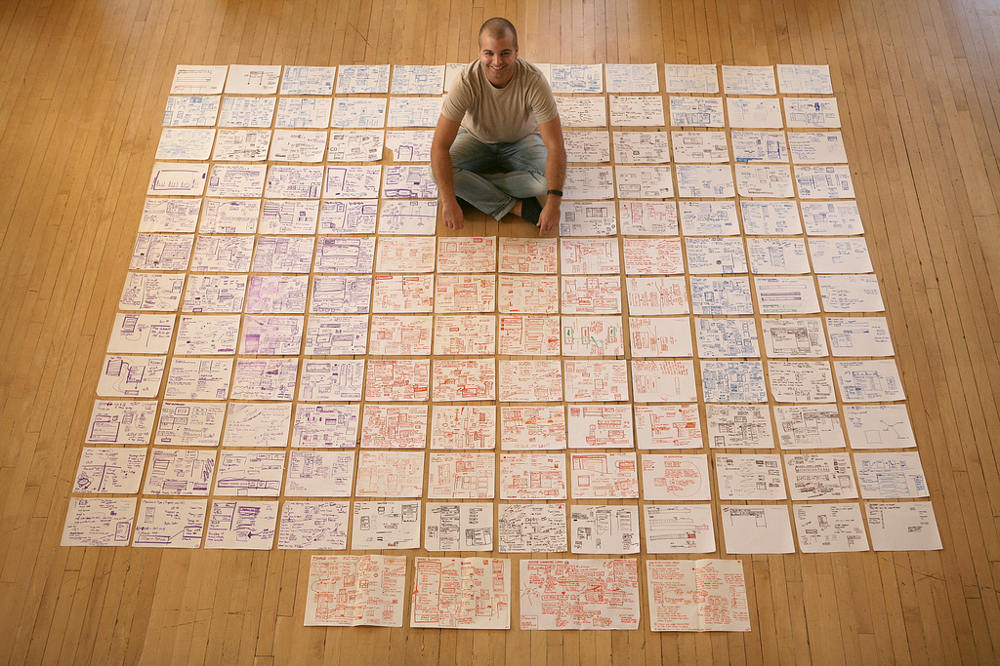

% Metodología de diseño de interfaces usables
% Juan Morales del Olmo
% 27 de enero de 2015

# Interacción hombre-máquina

## Usabilidad

* ¿Cómo lo definiríais?

## Usabilidad

Según el ISO 9241 "Ergonomics of Human-System Interaction", los objetivos son maximizar:

* Efectividad
* Eficiencia
* Satisfacción

-------------------------------------------------------------------------------

Si nos centramos más en la práctica. Se puede medir y evaluar:

* Tiempo en aprender a realizar la tarea

* Velocidad de realización (de la tarea de *benchmark*)

* Ratios de error, ya sea de número como de tiempo en solucionarlos

* Tiempo que los usuarios recuerdan cómo usar la interfaz

* Satisfacción subjetiva

-------------------------------------------------------------------------------

* ¿ Cómo lo conseguimos ?

## Diseño centrado en usuario

* **El usuario está involucrado en todas las etapas de diseño**

	* Minimiza los riesgos más importantes:
		* No conocer al **usuario**
		* No conocer la **tarea**

-------------------------------------------------------------------------------

* Marida mal con el modelo desarrollo software *en cascada*
	* Se nos dan unos requisitos... que pueden estar equivocados 
	* Lo que entregamos al final del proceso no tiene nada que ver con lo que el usuario esperaba

-------------------------------------------------------------------------------

-------------------------------------------------------------------------------

* Hay que utilizar un desarrollo iterativo
	* Se va en espiral:
		* Requisitos -> Diseño -> Implementación -> Pruebas -> ...
	* Basado en prototipos y/o funcionalidades

-------------------------------------------------------------------------------

* Metodologías ágiles de desarrollo (ej: *SCRUM*) se adaptan muy bien
	* Invitar al usuario a las reuniones de diseño
	* Ciclos cortos (sprints de pocas semanas)

## Conocer al usuario

* Tipificar al usuario según:
	* Usuario novato
	* Con conocimiento pero uso intermitente
	* Experto y con uso frecuente del sistema (*Power user*) 
* Experiencia con ordenadores (u otras interfaces similares)
* Discapacidades motoras y sensoriales
* Rangos de edad
* Entorno de trabajo

## Conocer la tarea

Engloba lo que en educción de requisitos se llama: *Requisitos funcionales y no funcionales*

>* Identificar las tares de Alto nivel y descomponerlas en tareas de bajo nivel
>* Frecuencia de cada tarea (ej: poco usadas a menús)
>* Lenguaje del dominio de aplicación (menús, colores)
>* Tiempos que hay que satisfacer (ej: tiempo real, batch)
>* Sesión típica de trabajo (ej: uso esporádico, 8 horas al día)
>* Tolerancia a errores (ej: tarea crítica en central nuclear)

# Técnicas de diseño

## ¿ Qué es diseño ? ##

**Proceso** previo a la realización en la **búsqueda de una solución** en
cualquier campo

> - Espacio de diseño
> - Decisiones de diseño

## ¿ Qué buscamos ? ##

. . .

## ¿ Qué proceso ? ##

--------------

--------------

## Técnicas ##

- Bocetos

- Escenarios

- Patrones de diseño

- Prototipos

## Bocetos (sketches o wireframes) ##

* Diseño viene de *disegno*. Dibujo en italiano

>* **La técnica más importante del diseño de interfaces es el bocetado**
	* No utilizar software de dibujo
	* "A mano". Con lápiz y papel o pizarra.

>* Generar **muchas** ideas

>* Diseñar en grupo

--------------

## Ejemplo de bocetos ##

--------------

--------------

--------------

## Escenarios ##

Son historias de usuarios usando el sistema.

>- Concretas (con detalle), realistas pero imaginativas
>- Tiene que incluir los objetivos de los usuarios
>- Muestra el proceso para conseguir su objetivo
>- Desarrollan y concretan las tareas 

>- Los usuarios son *personas* (estereotipos)

## Ejemplo de escenario ##

Tarea: "Buscar datos"

Miguel, que es un veinteañero moderno, quiere poder zanjar todas las
conversaciones de bar buscando con su móvil las respuestas sin enfadar
a sus amigos con continuas búsquedas en Google. Mientras sus amigos
hablan él escucha, pero cuando se enzarzan en una discusión
demostrable, Miguel buscará en el móvil los datos que se debaten y se
los mostrará a sus amigos.

## Storyboard ##

- Es un conjunto de bocetos que ilustran un escenario

> - Son los primeros prototipos de un diseño
	- Muestran cómo el diseño puede ser usado para alcanzar un objetivo

## Prototipos ##

- **Sirven para comunicar rápido (antes de implementar) y rediseñar**

> - Son bocetos de "alta fidelidad"

> - Se pueden hacer con software que soporte interacción pero no es
  necesario.

> - Detallan la navegación, las reacciones y transiciones.

## Patrones de diseño ##

> - Son soluciones comunes a problemas comunes

> - Mejoran la comunicación
	- Son usados frecuentemente y se entienden

> - Limitan la libertad en el diseño (reducen el espacio de diseño)

## Patrones de diseño ##

- Patrones generales:
	- <http://designinginterfaces.com/patterns/>
	- <http://www.cs.helsinki.fi/u/salaakso/patterns/>

- Widgets
	- QtWidgets
	- QtQuick Controls

## Resúmen ##

>- Genera muchas ideas

>- Plasma tus ideas utilizando bocetos, scenarios y storyboards

>- Evalúa y comunica pronto por medio de prototipos

>- Estudia patrones de diseño y utilízalos cuando encajen

