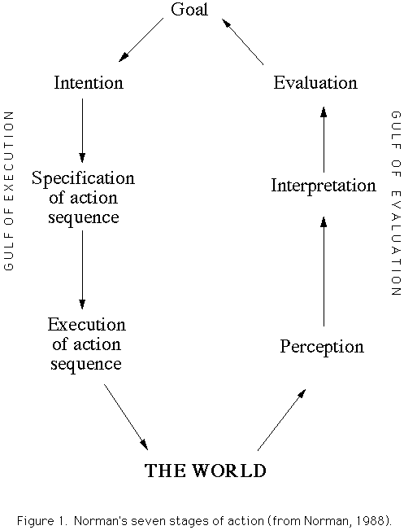
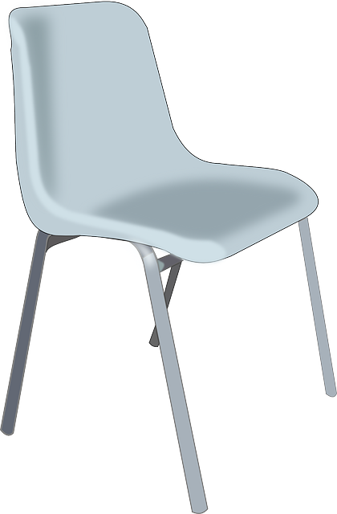
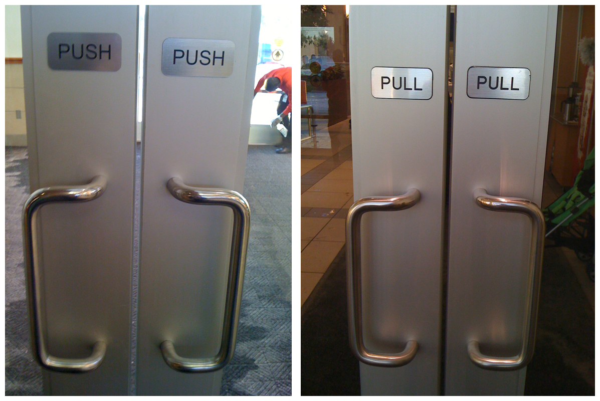

% Dimensiones de la usabilidad
% Juan Morales del Olmo
% 11 de febrero de 2016
	
# Dimensiones de Usabilidad

-------------------------

- **Facilidad de aprendizaje:**

	>- ¿Es fácil de aprender?

- **Eficacia:**

	>- Una vez aprendido, ¿es rápido de usar?

- **Visibilidad:**

	>- ¿ El estado del sistema es visible ?

- **Errores:**

	>- ¿ Induce a errores? ¿ La recuperación es sencilla ?

- **Satisfacción:**

	>- El usuario disfruta al usarlo

# Facilidad de Aprendizaje

## Memoria ##

- Memoria de trabajo (ó a corto plazo) :
	- 5 ± 2 *Chuncks*
	- ~ 10 segundos de vida
	
- Memoria a largo plazo: 
	- No parece tener límites temporales ni de espacio
	- Parece que se almacenan cosas por relación

## Reconocer mejor que recordar ##

- Reconocer es traer a la memoria de trabajo con ayuda

- Recordar es lo mismo pero sin ayuda

- Mucho mejor que *"el conocimiento esté en el papel"*

## Los 7 pasos de la acción ##

## Modelos ##

- Modelo del Sistema
- Modelo de la Interfaz
- Modelo Mental

## Modelo del sistema ##

- El modelo del sistema es **cómo funciona** 

> - modelos distintos para mismo fin:
	- photoshop vs inkscape
	- ed vs emacs

## Modelo de la interfaz ##

- Es el modelo que la interfaz transmite al usuario por la interfaz

>- Debe ser:
	- Apropiado al modelo mental no necesariamente al del sistema 
	- Simple

Ej: teléfono analógico y móvil. Mismo modelo de interfaz aun cuando el
modelo del sistema del móvil es mucho más complicado

## Modelo mental ##

- Es cómo piensa el usuario que el sistema funciona

- Si no es similar al modelo de la interfaz es que hay error de
  comunicación, probablemente falta *feedback*

- Ej: termostato

## Principios para facilidad de aprendizaje ##

>- Hay que dar pistas para transmitir el modelo correcto.
	- Apariencias de uso (Affordances)
	- Natural mapping
	- Visibilidad
	- Feedback

>- Consistencia
	- Interna en la herramienta
	- Externa con el resto del entorno
	- Metáforas
	- Hablar el lenguaje del usuario

-------------------------

-------------------------

## Resúmen ##

> - Interfaces fáciles de aprender deben transmitir al usuario el modelo mental correcto.
	- Usando affordances, natural mapping, visibilidad
	- Considerando metáforas
	- Siendo consistente interna, externa y con las metáforas
	- Conocimiento en el mundo mejor que en la cabeza

# Visibilidad

## ¿Qué hacer visible? ##

- Visibilidad de las **acciones**

- Visibilidad del **modelo**

- Visibilidad del **feedback**

## Foco de atención ##

- Sólo podemos atender a un canal a la vez

- Capacidad cognitiva depende del canal
	- interferencias
	- limitaciones (ej: fovea)

## Acciones ##

- La mejor técnica es el uso de *Affordances*

>- Botones y enlaces
>- flechas de menú
>- Agarraderas
>- icono del cursor
>- Resaltado de objetos con foco
>- Atajos en los menús
>- Tooltips
>- Auto descubribles (ej: comandos Excel)

## Modos perfectamente visibles ##

>- Modos ocultos llevan a muchos errores (vi)
>- Más visibles que Caps Lock
>- Mejor usar paletas de herramientas (paint)

## Visibilidad del estado ##

- El estado del sistema debe ser visible

> - El problema es **qué** y **cómo** hacerlo visible
	- Simplicidad va en contra de mostrar todo

> - Punto fuerte de las **Interfaces de manipulación directa**

## Estado de la interacción ##

- La interacción también tiene que ser visible
	- selecciones
	- drag & drop

## Feedback ##

**Todas las acciones tienen que presentar una repercusión**

- De bajo nivel como los estados de un botón

- De alto nivel como el estado de un navegador web

- **Ojo** con cargar de feedback 

## Tiempos de respuesta

* Acciones percibidas como instantáneas: **50 - 150 ms** ()
* Acciones frecuentes y simples, percibidas como inmediatas: **menos de 1 segundo**
* Acciones comunes: **2-4 segundos**
* Acciones complejas: **8-12 segundos**

* Más de **15 segundos** pierdes la atención del usuario

## Tiempos de respuesta (recomendaciones)

* **Es un elemento más de diseño:**
	* Lo normal es: mejor cuanto menor sean los tiempos de espera
	* Pero tiempos cortos llevan al usuario a pensar menos sus acciones

* Los tiempos de espera largos tiene que ser avisados
* Para esperas de más de 2 segundos se necesita enseñar algún feedback
* Para esperas de más de 10 segundos, enseñar el proceso

* **Lo peor son retardos inesperados**. Hay que controlar la varianza de los tiempos de espera para la misma acción

## Resúmen ##

>- Hacer visibles las acciones, estado y respuestas
>- El foco de atención afecta a la visibilidad 
>- Tiempos de respuesta impuestos

# Eficiencia #

## Hacer más con menos ##

- Mediremos tiempos e interacciones

- Vamos a ignorar cómo hacer más rápido el software 

## Tiempos de procesadores ##

- Tiempo de percepción ~ 100ms ciclo
- Tiempo de cognición ~ 70ms ciclo
- Tiempo motor ~ 70ms ciclo

- variaciones x10 entre personas
- condiciones afectan mucho

## Eventos simultáneos ##

> - Si os eventos se perciben en menos de 100ms parecerán simultáneos 

> - Causalidad depende de este tiempo

## Cognición ##

- Compara estímulos y elige una respuesta
>- Los tiempos dependen de si la respuesta está basada en:
	- práctica (montar en bici)
	- conocimiento 

## Procesamiento motor ##

- Se inicia la acción, se da la orden mientas que no se tiene feedback ~ 70ms

- Los músculos y sentidos van actualizando continuamente la situación

## Ley de Fitts ##

## Consecuencias de la ley de Fitts ##

> - Los botones en **los bordes** de la pantalla son muy rápidos de accionar

>- Menús en Mac vs Windows
>- Botón de inicio y cerrar ventana

## La práctica influye ##

- El tiempo total (Percepción + Cognición + Motor)

## Reducir la interacción ##

- Con atajos de teclado

>- Agregando mandatos
	- Scripts
	- Settings predefinidos
	- *Sí a todo*

## Memoria espacial ##

- Reducimos tiempo buscando las cosas donde *sabemos* que están

>- Como guía: **No cambiar de sitio los elementos si no es necesario**

## Resúmen ##

>- Mayor tamaño reduce tiempo en interfaces con puntero (ratón y táctil)
>- Los bordes de la pantalla *dan tamaños máximos*
>- Usa atajos de teclado
>- Agregar mandatos
>- Respetar la memoria espacial

# Errores #

## Tipos de errores ##

- Pifias involuntarias
	- Fallos motores
	- memoria a corto plazo

- Fallos de concepto
	- Modelos de sistema/mental no sincronizados

## Causas típicas de fallo ##

- Falta de atención provoca pifias

- Elección errónea por similitud

- Elección errónea por alta frecuencia

## Manejo de errores ##

- Prevención
- Recuperación de los errores

## Prevención ##

Está muy ligado las otras dimensiones de usabilidad

>- Por ejemplo, cosas a tener en cuenta:
	- Tamaño de los botones y de márgenes
	- Iconos y textos claros
	- Elementos que se lucen igual se deben comportar igual
	- Comandos complicados de ejecutar
	- Interrupciones a mitad de proceso
	- Errores provocados por modos

## Diálogos de confirmación ##

- ¿ Realmente funcionan ?

> - Normalmente entorpecen
> - La atención la quitan del proceso
> - Si son repetitivos se aprende a "pulsar doble", con lo que no sirven cuando realmente serían necesarios

## Mensajes de error ##

- **Los mejores son los que no existen**

>- Siempre en lenguaje de usuario
>- Sugerir posible causa del error
>- Proponer el siguiente paso a dar
>- Mejor situarlos en el contexto (ej: formularios en rojo)
>- Si son modales, con vía de escape siempre (la X o Cancel)

## Libertad de uso ##

- Cuanta más libertad más posibilidades de error

>- Pero la sensación de control es muy importante
>- Las mejores interfaces son explorables (facilidad de aprendizaje)

## Undo/Redo ##

- Permiten explorar acciones y deshacerlas sin miedo

>- La granularidad es un elemento de diseño

>- La visibilidad suele ser difícil de conseguir

>- Permitir al usuario las acciones CRUD

## Resúmen ##

- **Mejor prevenir** pifias y fallos con elementos de usabilidad
- Mensajes de error adecuados
- Undo/Redo facilitan recuperación de errores y aumentan facilidad de uso

# Satisfacción #

## Sensación subjetiva ##

>- Tiempos afectan
	- Sensación de fluidez mejora la experiencia
	
>- Diseño gráfico/artístico afecta
	- Pero es más subjetivo
	- Interfaces bonitas percibidas como más usables

>- Bajar carga cognitiva
	- Simplificar
	- Reducir memorización e interacción

## Recomendaciones ##

- Principal: **Diseño centrado en usuario**

>- Reforzar la sensación de control
>- Reducir sensación de esperar, por ejemplo con transiciones
>- Maximizar:
	- Facilidad de uso
	- Visibilidad
	- Eficiencia
	- Manejo de Errores

# Estilos de interacción #

## ¿ Cómo los situaríais en las dimensiones? ##

- Línea de mandatos
- Menús y formularios
- Manipulación directa

